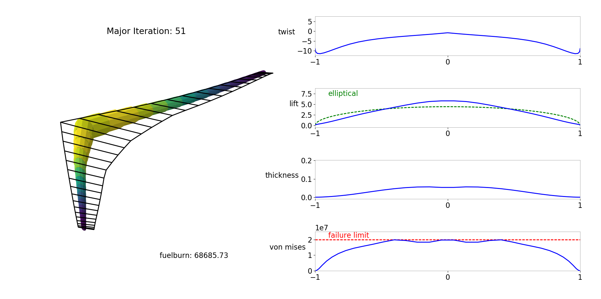
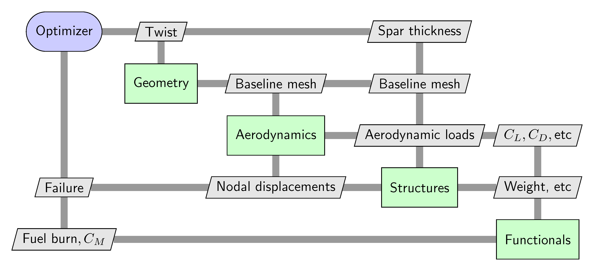
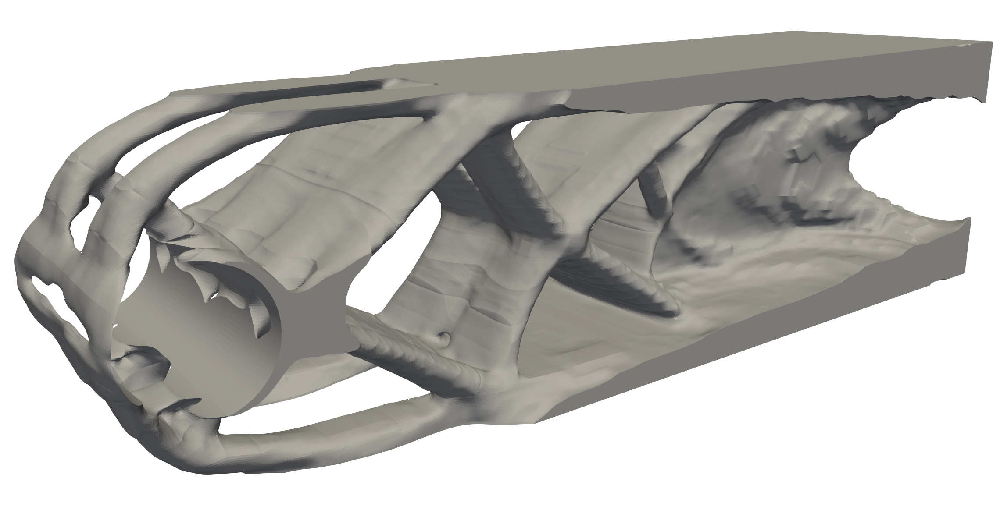

AE6310 Course Notes
===================

Welcome to AE6310: Optimization for the Design of Engineered Systems.

AE6310 is about the application of numerical optimization methods to the design of engineering systems.

Aeroelastic example
*******************

Aircraft wings are flexible and deform under aerodynamic load, twisting and bending relative to their undeformed shape.
The aerodynamic loads, in turn, depend on the deformed shape of the wing.
As a result, there is a tight coupling between aerodynamics and structures.
To find the equilibrium shape of the wing, we have to couple aerodynamic and structural disciplines together into a single analysis.

Aerostructural optimization consists of finding the wing planform, shape and structural sizing variables that optimize the performance of the aircraft.
The following is a simple aerostructural optimization from the open source tool `OpenAeroStruct <https://github.com/mdolab/OpenAeroStruct>`_.

A key consideration in multidisciplinary design problems is connecting the different disciplines together for analysis and design.
The extended design structure matrix (XDSM) diagram is a convenient way to visualize how the different analysis components interact together.
The following XDSM diagram is from the above aerostructural optimization problem.

Structural topology optimization example
****************************************

In structural design you often do not know in advance the best structural shape or topology to meet design requirements.
Topology optimization methods are designed to generate an optimized structure, free from restrictions on the shape or topology.

This image illustrates the results of a topology optimization case where the the objective is to minimize the mass of the structure subject to a constraint on the approximate maximum stress.
Topology optimization problems may involve millions of design variables and require the solution of a challenging finite-element simulation.
This course does not cover topology optimziation specifically, however this type of application can be tackled with the knowledge and theory developed in this course.

Table of Contents
*****************

.. toctree::
   :maxdepth: 2

   intro_to_python.rst
   jupyter/Introduction.ipynb
   jupyter/Unconstrained_Optimization_Theory.ipynb
   jupyter/Minimization_of_Quadratic_Functions.ipynb
   jupyter/Fundamentals_Unconstrained_Opt_Algorithms.ipynb
   jupyter/Line_Search_Methods.ipynb
   jupyter/Line_Search_Algorithms.ipynb
   jupyter/Trust_Region_Methods.ipynb
   jupyter/Constrained_Optimization_Theory.ipynb
   jupyter/Constrained_Optimization_Algorithms.ipynb
   jupyter/Introduction_to_Simulation-based_Optimization.ipynb
   jupyter/Trajectory_Optimization_Case_Study.ipynb
   jupyter/PDE_Constrained_Optimization.ipynb
   jupyter/Multidisciplinary_Optimization.ipynb
   jupyter/Surrogate_Modeling.ipynb
   jupyter/Derivative_Free_Optimization.ipynb
   jupyter/2026_project/race_car_problem.ipynb
   jupyter/2025_project/Class_Project_Description.ipynb

Indices and tables
==================

* :ref:`genindex`
* :ref:`modindex`
* :ref:`search`
